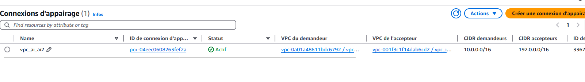

# AwsOrchestration

## Examen AWSORC : Alicia OLIVIERI - Thibaut LORETTE

# Projet E4 AWS 

## Lien vers notre infrastructure de nos deux parties :
https://miro.com/app/board/uXjVIbu02fE=/

## Partie 1 - Déploiement d'une architecture Cloud

### Contexte
Dans le cadre de ce projet, on a intégré une équipe DevSecOps dans une grande entreprise française 🐓. Notre Scrum Master nous a confié la mission de déployer une architecture cloud sur Amazon AWS pour un nouveau client.

L'objectif est de mettre en place un environnement de développement en minimisant les coûts. Pour cela, les éléments suivants doivent être déployés :

- **Un seul VPC** (Virtual Private Cloud) pour le MVP.
- **Une application accessible depuis l'extérieur**. 
- **Une base de données dédiée avec une haute mise à l'échelle**, accessible par l'application.
- **Un serveur de test dans le VPC**, non accessible directement via Internet, mais avec un accès sortant pour les mises à jour.
- **Un hébergement statique** pour stocker différentes documentations accessibles via Internet.
- **Un système de sauvegarde** pour l'application et la base de données, avec un seul backup pour le MVP.

### Déploiement de l'Infrastructure AWS
#### 1. Création du VPC
Pour commencer, nous allons créer un VPC. Dans celui-ci, on créera **deux subnets**.
Le premier sera un **public subnet**, dans lequel on aura l'application et le stockage statique.
Dans le deuxieme, on aura un **private subnet**, et on y mettra notre base de données RDS et le serveur de test.


Pour la création du VPC, on a gardé la Passerelle S3 car on en aura besoin pour le stockage statique. Et on a aussi choisi de prendre une zone de disponibilité pour la passerelle NAT.


Ensuite on crée notre passerelle NAT attachée a notre VPC pour que notre serveur de test, qui n'a pas d'adresse IP Public, pourra tout de même avoir accès à internet.


On met notre passerelle NAT et Internet dans le subnet Public. Mais on va mettre, dans la table de routage du private, un chemin vers la passerelle NAT pour avoir accès.


#### Pour résumer, dans cette partie, on a : 
- Créer un VPC.
- Créer deux sous réseaux, un public et un private.
- Les adressses IP :
```sh
VPC Adresse : 10.0.0.0/16
Zone A :Public Subnet : 10.0.0.0/20
Zone B :Private Subnet : 10.0.144.0/20
```
- Créer une passerelle internet pour le Public.
- Créer une Nat Gateway dans le Public, et avoir mis dans la table de routage du private un accès.

#### 2. Déploiement des instances

On va déployer 2 instances. La premiere sera celle qui sera dans la public subnet, donc une ayant accès à Internet. Dans celle-ci, on aura notre application Python.

Pour la création de notre instance, j'ai mis comme nom "olivieri_app" avec comme démarrage, un serveur **Ubuntu**. J'ai crée une nouvelle clé unique "cleexamen". Pour les parametres réseaux, je lui ai donné le VPC qu'on a crée juste avant, le sous réseau public, et j'ai activé l'adresse IP Publique : 


De plus, je lui ai déjà donnée les groupes et regles de sécurités. J'ai donné : 
- SSH, qui est obligatoire pour avoir accès à notre app.
- HTTP, HTTPS : Pour avoir accès à l'exterieur via internet
- MySQL : Pour pouvoir avoir accès à notre base de donnée.
- Port 5085 : pour mon application


Je lui ai mis à la fin une config, afin de le configurer plus facilement.

```bash
#cloud-config
 
# Mettre le bon timezone
timezone: Europe/Paris
 
# Update et upgrade
package_update: true
package_upgrade: true
 
# Installation des packages nécessaire (uidmap pour docker rootless)
# sudo apt install apt-transport-https bash-completion ca-certificates curl git uidmap
packages:
  - apt-transport-https
  - bash-completion
  - ca-certificates
  - curl
  - git
  - uidmap
 
# Lancer des commandes
runcmd:
  - curl -fsSL https://get.docker.com -o get-docker.sh && sudo sh get-docker.sh
  - sudo -u ubuntu dockerd-rootless-setuptool.sh install --force
  - systemctl start docker
  - systemctl enable docker
  - docker run -d --name mynginxserver -p 8080:80 nginx:alpine-slim
```
J'ai crée en parallele mon instance "examen_servertest" pour le serveur de test. Dans celui-ci, on lui donnera un sous réseau privé, et on desactivera l'adresse Ip Publique


#### Pour résumer, dans cette partie, on a : 
- Créer notre instance pour l'application avec :
    - IP Public : 18.144.15.92
    - Créer les regles de sécurités : 
        - SSH
        - HTTP, HTTPS,
        - MYSQL
- Créer notre instance pour le serveur de test :
    - Pas d'adresse Ip Public
    - Regle de sécurité :
        - Uniquement SSH


#### 3. Déploiement de la base de données

Pour la création de notre Base de données RDS, on a choisi comme moteur le MySQL avec un modèle gratuit. On a connecté notre base à notre instance ayant l'application.


Les données importantes de notre base :
```bash
- Identifiant Instance : id-examen
- Identifiant Nom : admin
- Nom de la base de donnée : examen
- Mot de passe : azertyui 
```
#### 4. Connexion à notre application 

Pour se faire, je me suis mis sur VSCode pour que ce soit plus simple.
J'ai modifié dans le .ssh/config mes informations, donc :

```bash
Host examen
    HostName 18.144.15.92 
    User ubuntu
    IdentityFile C:\Users\nom\Downloads\cleexamen.pem
```


J'ai ensuite mis mon application : 

```bash	
git clone https://github.com/app-generator/flask-datta-able
cd flash-datta-able
docker compose up -d
```
Je modifie dans mon .env les informations de ma base de données donc :

```bash
# True for development, False for production
DEBUG=False

# Flask ENV
FLASK_APP=run.py
FLASK_DEBUG=1

# If not provided, a random one is generated 
SECRET_KEY=examen

# Used for CDN (in production)
# No Slash at the end
ASSETS_ROOT=/static/assets

# If DEBUG=False (production mode)
DB_ENGINE=mysql
DB_NAME=examen
DB_HOST=id-examen.czcc4yewi3vy.us-west-1.rds.amazonaws.com
DB_PORT=3306
DB_USERNAME=admin
DB_PASS=azertyui
```
J'ai aussi rajouté dans le requierement.txt
```
mysqlclient
```

Avant de me connecter à ma base de données, je test si j'ai accès à mon site sur internet, et c'est le cas :


Maintenant on va essayer de relier la base de données et d'enregistrer une modification.

On fait toutes les mis à jour et on installe le client mysql : 

```
sudo apt update && sudo apt-get install default-mysql-client
mysql -h id-examen.czcc4yewi3vy.us-west-1.rds.amazonaws.com -u admin -p 
```

On a bien accès à notre base depuis l'application : 


Suite à ça, on va essayer de voir si on modifie l'application, est ce que on aura une modification dans la base, c'est à dire, est ce qu'on aura de nouvelles tables dans notre base 'examen'


La réponse est oui, on a donc bien le lien entre l'application et la base de données.

### Connexion à notre servertest
---

#### Connexion
---

Pour se connecter à notre servertest, et en ayant deja créer la passerelle NAT, on peut directement aller dans notre terminal.
Dans celui-ci, on se trouve donc dans notre instance Application ayant une clé publique, on va recréer notre clé rsa. Pour ce faire on va copier notre clé rsa de base dans notre instance, puis on va pouvoir faire un ssh vers notre servertest.
Et pour confirmer qu'on a bien internet, il suffira de faire un sudo apt update, si ça marche c'est que j'ai internet grâce à mon NAT Gateway.

```
TERMINAL WINDOWS :
scp -i .\cleexamen.pem .\cleexamen.pem ubuntu@18.144.15.92:~/
TERMINAL INSTANCE APPLICATION IP PUBLIQUE :
chmod 400 cleexamen.pem
ssh -i cleexamen.pem ubuntu@10.0.152.91
sudo apt update
```


#### Création du Bucket pour un site web statique
---

Ici je peux créer mon Bucket pour un site web statique. Pour ce faire je vais créer mon bucket :
examen-docu-olivieri, dans celui ci, je débloque tous les acces pour qu'il soit public, et j'active les ACL.
Ensuite, dans liste de controle ACL (liste des controles d'acces), je confirme que tout le monde peut avoir accès à la lecture. Maintenant, je peux charger mon site html, en n'oubliant pas de leur donné l'acces public au ACL.
Ensuite, on va activer le web site statique et c'est parfait.




#### Backup de notre application - base de donnée
---

Dans l'interface RDS, j'ai crée un instantané de ma base de donnée. Maintenant il suffit juste de l'exporter dans le S3 afin d'avoir acces à la sauvegarde.

---

## Partie 2 - Ajout d'un environnement IA
### Contexte
---
Le client souhaite ajouter une nouvelle équipe concernant le développement de l'IA et aimerait donc scinder les différents environnements. L'équipe à donc besoin d'un deuxième environnements qui puisse avoir internet mais sans être accessible directement. Un serveur suffira dans ce réseau.
### Implémentation
---

Pour commencer, je crée deux VPC dont un avec le NAT Gateway, avec dedans un serveur chacun. 
je fais un peering entre les deux.


Je mets dans les routables la connexion de parrainage et je crée mes deux instances. Une dans le vpc 1 en public et ma deuxieme instance dans le vpc 2 private.

Je peux maintenant me connecter sur la premiere instance sur mon terminal vscode, je crée ma clé rsa et je me connecte à mon 2e instance dans lautre vpc.

```
Host peering
        HostName 54.176.232.253
        User ubuntu
        IdentityFile C:\Users\aylen\Downloads\cleexamen.pem

scp -i .\cleexamen.pem .\cleexamen.pem ubuntu@54.176.232.253:~/
chmod 400 cleexamen.pem
ssh -i cleexamen.pem ubuntu@192.0.133.172
```

Etant donné qu'on a bien parainnée et que on a mis les bonnes informations dans les sécurités groupes, on aura accès à internet.

---

## Conclusion

Dans le cadre de ce projet, j'ai pris en charge l'intégration complète d'une architecture cloud sur Amazon AWS pour un client, en respectant les contraintes et les besoins spécifiés. Le déploiement a inclus la création d'un VPC unique pour le MVP, l'ajout d'une application accessible depuis l'extérieur, d'une base de données hautement scalable connectée à l'application, ainsi qu'un serveur de test dans un sous-réseau privé pour limiter l'accès. Un hébergement statique via S3 a également été configuré pour stocker les documentations du client.En parallèle, des mécanismes de sauvegarde régulière pour l'application et la base de données ont été mis en place, et j'ai utilisé les services AWS comme RDS et S3 pour stocker ces backups.

Concernant la Partie 2, le client a exprimé la volonté d'ajouter une équipe de développement IA, nécessitant ainsi un deuxième environnement avec un accès internet, mais limité en termes de sécurité, ce qui a conduit à la création de nouveaux sous-réseaux et configurations de sécurité.

Toutefois, étant donné que j'ai pris en charge l'intégralité du projet, de la conception à la gestion du code et des configurations, je n'ai malheureusement pas eu le temps de terminer toutes les étapes, notamment certains ajustements pour les sauvegardes et la configuration finale des environnements. Malgré cela, l'essentiel de l'architecture et des fonctionnalités est en place, et cette base permettrait une poursuite et une extension efficaces du projet.

